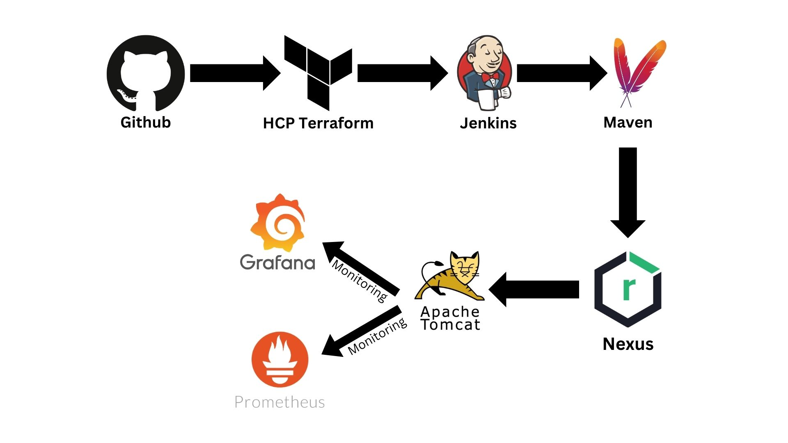

# Build-Deploy-Web-App-with-CI-CD-Pipeline
# 🚀 Netflix Application – DevOps Pipeline 🚀

This is my **first DevOps project** where I built a complete CI/CD pipeline to deploy a Netflix application on AWS, fully automated from infrastructure provisioning to monitoring.  

## 📌 Project Overview
The goal of this project was to gain **hands-on experience** with infrastructure automation, continuous integration, continuous deployment, and observability.

## 🛠 Tech Stack & Tools
- **Terraform HCP** – Provisioned AWS EC2 instances
- **Jenkins** – CI/CD pipeline automation
- **Maven** – Build management
- **Nexus** – Artifact repository
- **Tomcat Server** – Application hosting
- **Grafana & Prometheus** – Monitoring and observability

## 📂 Project Workflow
1. **Infrastructure as Code (IaC)** – Used Terraform HCP to provision EC2 instances automatically.
2. **Continuous Integration** – Jenkins pipeline pulls code from GitHub, builds it with Maven, and pushes artifacts to Nexus.
3. **Continuous Deployment** – Jenkins deploys the artifact to Tomcat Server on the EC2 instance.
4. **Monitoring** – Prometheus collects metrics, Grafana visualizes them for real-time insights.

## 📸 Architecture Diagram

## 🚀 Key Learnings
- Setting up **Infrastructure as Code** with Terraform HCP
- Automating **builds, testing, and deployments** with Jenkins
- Managing **artifacts** using Maven and Nexus
- Deploying applications on **Tomcat**
- Implementing **monitoring & alerting** with Prometheus and Grafana
